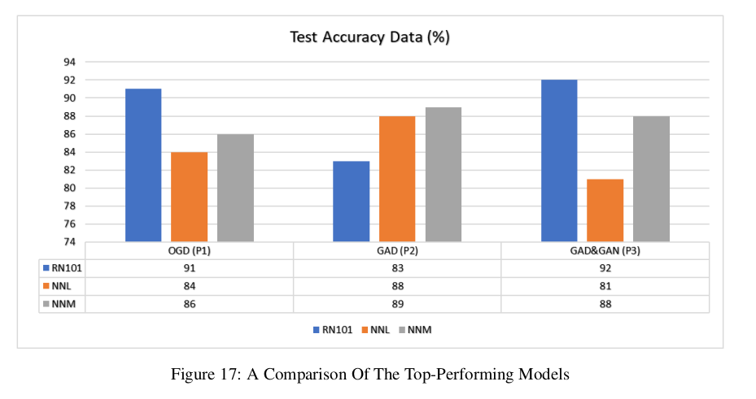
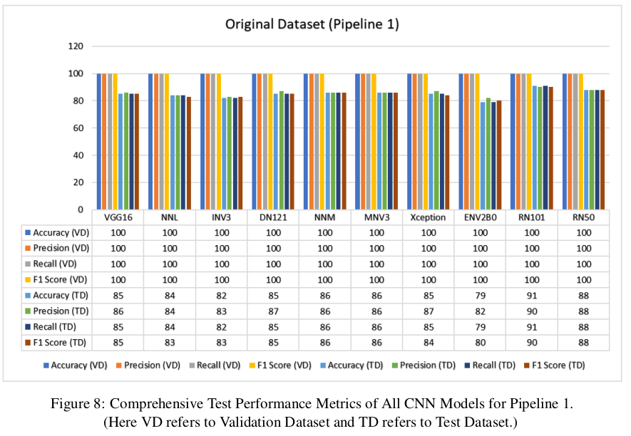
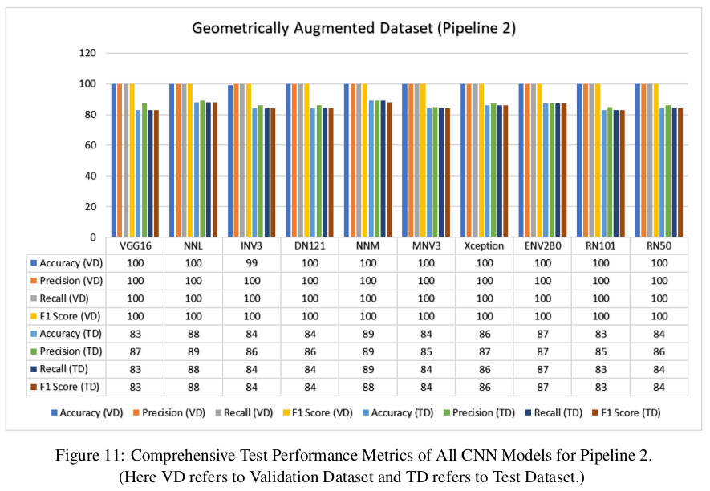
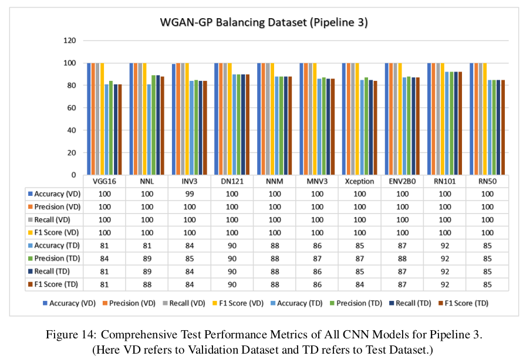

# 🌾 Rice Leaf Disease Classification using CNNs

## 📌 Overview
This project presents a comparative study of 10 CNN architectures for classifying rice leaf diseases.

## 🧠 Models Compared
- VGG16
- ResNet50, ResNet101
- DenseNet121
- EfficientNetV2B0
- Xception, InceptionV3
- MobileNetV3
- NASNet (Mobile & Large)

## ⚙️ Pipelines Used
1. Original Imbalanced Dataset
2. Geometric Augmentation
3. WGAN-GP Balanced Dataset

## 📊 Key Results
- Validation Accuracy: 99–100%
- Test Accuracy: 79–92%
- Best Model: **ResNet101 (92%)**

## 🔬 Research Contribution
- Identified generalization gap
- Showed importance of dataset balancing
- Demonstrated GAN-based augmentation effectiveness

## 📄 Publication Status
Submitted to:
**Engineering Applications of Artificial Intelligence (Elsevier)**

Status: Under Review  
Role: Contributing Author  

## 📁 Project Structure
(Explain folders)

## 📊 Results

### Model Performance Comparison

### Pipeline Comparison

## 🛠 Tech Stack
- Python
- TensorFlow / Keras
- NumPy, Matplotlib

## 👤 Author
Kshitij Ayush
