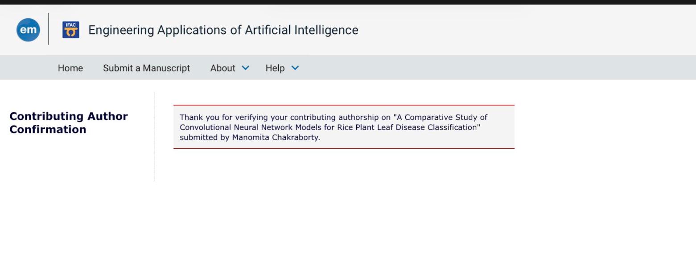

# 🌾 Rice Leaf Disease Classification using CNNs

## 📌 Overview
This project presents a comparative study of 10 CNN architectures for classifying rice leaf diseases.

## 🧠 Models Compared
- VGG16
- ResNet50, ResNet101
- DenseNet121
- EfficientNetV2B0
- Xception, InceptionV3
- MobileNetV3
- NASNet (Mobile & Large)

## ⚙️ Pipelines Used
1. Original Imbalanced Dataset
2. Geometric Augmentation
3. WGAN-GP Balanced Dataset

## 📊 Key Results
- Validation Accuracy: 99–100%
- Test Accuracy: 79–92%
- Best Model: **ResNet101 (92%)**

## 🔬 Research Contribution
- Identified generalization gap
- Showed importance of dataset balancing
- Demonstrated GAN-based augmentation effectiveness

## 📄 Publication Status
Submitted to:
**Engineering Applications of Artificial Intelligence (Elsevier)**

Status: Under Review  
Role: Contributing Author  

## 📁 Project Structure
'''bash
.
├── README.md
├── data
│   ├── Blast
│   │   ├── Blast_images
│   │   ├── Brusone (3).JPG
│   │   ├── IMG_0536.jpg
│   │   ├── IMG_0560.jpg
│   │   ├── IMG_0602.jpg
│   │   └── IMG_0605.jpg
│   ├── Blight
│   │   ├── BACTERAILBLIGHT3_031 (3).jpg
│   │   ├── BACTERAILBLIGHT3_037 (2).jpg
│   │   ├── BACTERAILBLIGHT3_047 (3).jpg
│   │   ├── BACTERAILBLIGHT3_073.jpg
│   │   ├── BACTERAILBLIGHT3_230 (2).JPG
│   │   └── Blight_leaf_images
│   ├── Brownspot
│   │   ├── Brown_spot  (10).jpg
│   │   ├── Brown_spot  (17).jpg
│   │   ├── Brown_spot  (21).jpg
│   │   ├── Brown_spot  (4).jpg
│   │   ├── Brown_spot  (9).jpg
│   │   └── Brownspot_images
│   └── Healthy
│       ├── Healthy_leaf_inages
│       ├── Healthy_rice_leaf  (10).jpg
│       ├── Healthy_rice_leaf  (12).jpg
│       ├── Healthy_rice_leaf  (14).jpg
│       ├── Healthy_rice_leaf  (18).jpg
│       └── Healthy_rice_leaf  (28).jpg
├── docs
│   ├── paper.pdf
│   └── submission_proof.png
├── requirements.txt
├── results
│   ├── ComparisonOfModels.png
│   ├── Pipeline_1.png
│   ├── Pipeline_1_TestSet.png
│   ├── Pipeline_1_ValidationSet.png
│   ├── Pipeline_2.png
│   ├── Pipeline_2_TestSet.png
│   ├── Pipeline_2_ValidationSet.png
│   ├── Pipeline_3.png
│   ├── Pipeline_3_TestSet.png
│   └── Pipeline_3_ValidationSet.png
├── src
│   ├── GAN_codes
│   │   ├── cgan.py
│   │   ├── cgan_2.py
│   │   ├── cgan_3.py
│   │   ├── cgan_4.py
│   │   ├── cgan_5.py
│   │   ├── cgan_blast.py
│   │   ├── cgan_blight.py
│   │   ├── cgan_blight_2.py
│   │   ├── cgan_brownspot.py
│   │   ├── cgan_golden_aug.py
│   │   └── image_generation.py
│   └── Training_and_test_codes
│       ├── DN121_1.py
│       ├── DN121_2.py
│       ├── EN_1.py
│       ├── EN_2.py
│       ├── Eb_1.py
│       ├── Eb_2.py
│       ├── IN_1.py
│       ├── IN_2.py
│       ├── NNL_1.py
│       ├── NNL_2.py
│       ├── NNL_test_1.py
│       ├── R101_1.py
│       ├── R101_2.py
│       ├── R50_1.py
│       ├── R50_2.py
│       ├── Test_final.py
│       ├── VGG16_Holdout_1.py
│       ├── VGG16_SKF_1.py
│       ├── VGG16_SKF_2.py
│       ├── VGG_Holdout_2.py
│       ├── VGG_SKF_1_evl.py
│       ├── Xception_1.py
│       ├── Xception_2.py
│       ├── data_aug_basic_blast.py
│       ├── data_aug_basic_blight.py
│       ├── data_aug_basic_browspot.py
│       ├── data_aug_basic_healthy.py
│       ├── mobilenetV3_1.py
│       ├── mobilenetV3_2.py
│       ├── test.py
│       ├── test_SKF.py
│       └── test_path.py
└── structure.txt '''

11 directories, 82 files

## 📊 Results

### Model Performance Comparison

### Pipeline Comparison

## 🛠 Tech Stack
- Python
- TensorFlow / Keras
- NumPy, Matplotlib

## ▶️ How to Run

### 1. Clone the repository
git clone https://github.com/Kshitij28042003/Rice-Leaf-Disease-CNN-Comparative-Study.git

### 2. Go into the project folder
cd Rice-Leaf-Disease-CNN-Comparative-Study

### 3. Install dependencies
pip install -r requirements.txt

### 4. Run all the sourco codes from src

## 🚀 Highlights

- Compared 10 CNN architectures (ResNet, VGG, DenseNet, EfficientNet)
- Designed 3 pipelines including GAN-based augmentation (WGAN-GP)
- Achieved 92% test accuracy using ResNet101
- Identified generalization gap (99–100% validation vs 79–92% test accuracy)

## 👤 Author
Kshitij Ayush
